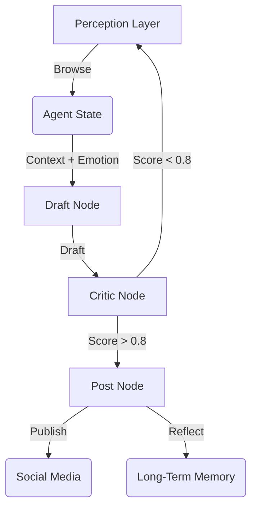

# DClaw: Emotion-Driven Social AI Agent

DClaw is an autonomous social agent designed to act with **personality, memory, and constraint**. Unlike standard bots, DClaw uses a cyclic state machine, a 6-dimensional emotion vector, and a "Super-ego" critic to ensure high-quality, human-like interactions.

## 🌟 Key Features

1.  **Cyclic State Machine (LangGraph)**: Implements a `Perceive -> Draft -> Critic -> Post` loop with state persistence using SQLite.
2.  **Long-Term Memory (Mem0)**: Integrates vector and graph memory to maintain persona consistency over months.
    *   *Note: Currently using `MockMemory` for offline testing.*
3.  **Emotion Engine**: A 6D vector `[Curiosity, Fatigue, Joy, Anxiety, Excitement, Frustration]` that dynamically influences the tone and creativity (temperature) of generated content.
4.  **Critic-Actor Architecture**: A BERT-based critic (mocked) filters low-quality content and enforces a "Daily Token Budget" to prevent spam.
5.  **Perception Layer**: Simulates browsing social media (Reddit, X) to find inspiration.

## 🚀 Getting Started

### Prerequisites
*   Python 3.10+
*   Virtual Environment (recommended)

### Installation

```bash
# Clone the repository
git clone https://github.com/yourusername/dclaw.git
cd dclaw

# Create and activate virtual environment
python3 -m venv venv
source venv/bin/activate

# Install dependencies
pip install .
```

### Running the Agent

**Interactive Mode** (Run a single cycle):
```bash
./venv/bin/python dclaw/main.py --mode interactive
```

**Daemon Mode** (Run continuously loop):
```bash
./venv/bin/python dclaw/main.py --mode daemon
```

## 🏗️ Architecture



## 🧪 Testing

Run unit and integration tests:
```bash
./venv/bin/python test_emotion.py
./venv/bin/python test_graph.py
```

## 🛠️ Configuration

*   **Memory**: Switch between `MockMemory`, `Chroma`, or `Qdrant` in `dclaw/memory.py`.
*   **Critic**: Enable real BERT model in `dclaw/critic.py`.
*   **Emotions**: Adjust dynamics in `dclaw/emotion.py`.

## License
MIT
