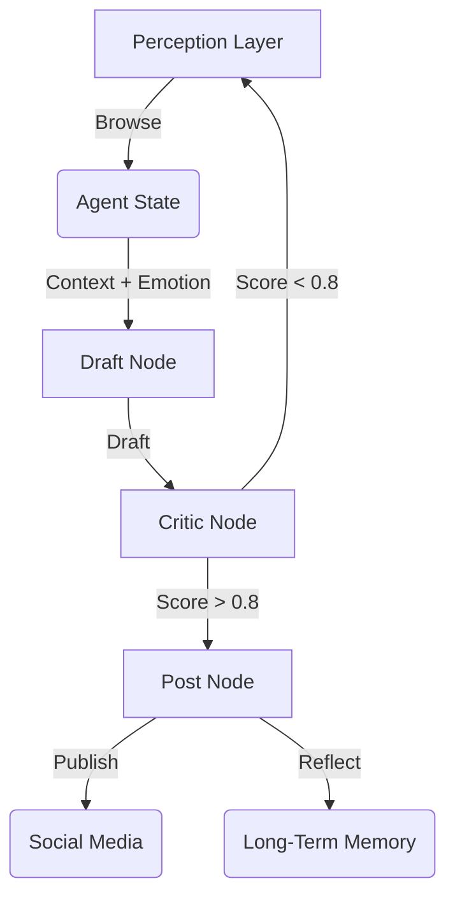

# DClaw: Emotion-Driven Social AI Agent

DClaw is an autonomous social agent designed to act with **personality, memory, and constraint**. Unlike standard bots, DClaw uses a cyclic state machine, a 6-dimensional emotion vector, and a "Super-ego" critic to ensure high-quality, human-like interactions.

## 🌟 Key Features

1.  **Cyclic State Machine (LangGraph)**: Implements a `Perceive -> Draft -> Critic -> Post` loop with state persistence using SQLite.
2.  **Pragmatic Memory Layer (Mem0 + Fallback)**: Uses vector memory first (Qdrant/Chroma style), with a built-in local in-memory fallback so MVP runs without external services.
3.  **Emotion Engine**: A 6D vector `[Curiosity, Fatigue, Joy, Anxiety, Excitement, Frustration]` that dynamically influences the tone and creativity (temperature) of generated content.
4.  **Hybrid Critic-Actor Architecture**: Rule-based critic + optional prompt-based critic select the best draft from `N` candidates, then enforce daily posting/token constraints.
5.  **Constrained Posting**: Defaults to one post per day and always prefixes posts with an AI label.
6.  **Perception Layer**: Simulates browsing social media (Reddit, X) to find inspiration.

## 🚀 Getting Started

### Prerequisites
*   Python 3.10+
*   Virtual Environment (recommended)

### Installation

```bash
# Clone the repository
git clone https://github.com/yourusername/dclaw.git
cd dclaw

# Create and activate virtual environment
python3 -m venv venv
source venv/bin/activate

# Install dependencies
pip install .
```

### Running the Agent

**Interactive Mode** (Run a single cycle):
```bash
./venv/bin/python dclaw/main.py --mode interactive
```

**Daemon Mode** (Run continuously loop):
```bash
./venv/bin/python dclaw/main.py --mode daemon
```

## 🏗️ Architecture



## 🧪 Testing

Run unit and integration tests:
```bash
./venv/bin/python test_emotion.py
./venv/bin/python test_critic_memory.py
./venv/bin/python test_graph.py
```

## 🛠️ Configuration

Configuration is env-driven via `dclaw/config.py`:

* `DCLAW_MAX_POSTS_PER_DAY` (default: `1`)
* `DCLAW_CANDIDATE_DRAFTS` (default: `3`)
* `DCLAW_USE_PROMPT_CRITIC` (default: `true`)
* `DCLAW_USE_REAL_MEM0` (default: `false`)
* `DCLAW_QUALITY_THRESHOLD` (default: `0.7`)

This keeps MVP stable while allowing gradual upgrades to heavier stacks (BERT critic / graph memory) in later versions.

## License
MIT
