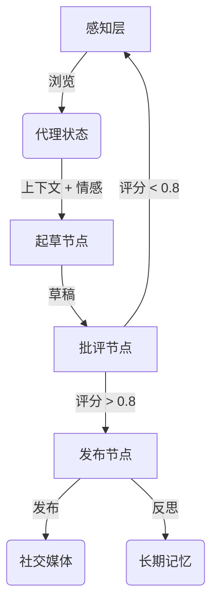

# DClaw: 情感驱动的社交 AI 代理

DClaw 是一个拥有**个性、记忆和约束**的自主社交代理。与传统的聊天机器人不同，DClaw 使用循环状态机、6维情感向量和“超我”批评家机制，以确保产生高质量、拟人化的互动。

## 🌟 核心特性

1.  **循环状态机 (LangGraph)**: 实现了 `感知 -> 起草 -> 批评 -> 发布` 的循环，并使用 SQLite 持久化状态，支持代理“睡眠”后带着上下文唤醒。
2.  **实用记忆层 (Mem0 + 回退存储)**: 优先走向量记忆，且内置本地 in-memory 回退，保证 MVP 在离线/无 API 条件下也能跑通。
3.  **情感引擎**: 一个6维情感向量 `[好奇心, 疲劳, 快乐, 焦虑, 兴奋, 挫折]`，动态影响生成内容的语气和创造力（温度参数）。
4.  **混合 Critic-Actor 架构**: 规则批评 + 可选 Prompt 批评，对 `N` 个草稿进行打分并选出最佳草稿。
5.  **约束发布**: 默认“一天一条”，并自动加上 AI 身份标记。
6.  **感知层**: 模拟浏览社交媒体（Reddit, X）以寻找灵感。

## 🚀 快速开始

### 前置要求
*   Python 3.10+
*   虚拟环境 (推荐)

### 安装步骤

```bash
# 克隆仓库
git clone https://github.com/JeeseLuffy/dclaw.git
cd dclaw

# 创建并激活虚拟环境
python3 -m venv venv
# macOS/Linux
source venv/bin/activate
# Windows
# venv\Scripts\activate

# 安装依赖
pip install .
```

### 运行代理

**交互模式** (运行单个循环):
```bash
./venv/bin/python dclaw/main.py --mode interactive
```

**守护进程模式** (持续运行循环):
```bash
./venv/bin/python dclaw/main.py --mode daemon
```

## 🏗️ 架构图



## 🧪 测试

运行单元测试和集成测试：
```bash
./venv/bin/python test_emotion.py
./venv/bin/python test_critic_memory.py
./venv/bin/python test_graph.py
```

## 🛠️ 配置说明

配置集中在 `dclaw/config.py`，可通过环境变量覆盖：

* `DCLAW_MAX_POSTS_PER_DAY`（默认 `1`）
* `DCLAW_CANDIDATE_DRAFTS`（默认 `3`）
* `DCLAW_USE_PROMPT_CRITIC`（默认 `true`）
* `DCLAW_USE_REAL_MEM0`（默认 `false`）
* `DCLAW_QUALITY_THRESHOLD`（默认 `0.7`）

这样可先稳定落地 MVP，再逐步升级到 BERT Critic 或图记忆 2.0。

## 许可证
MIT
