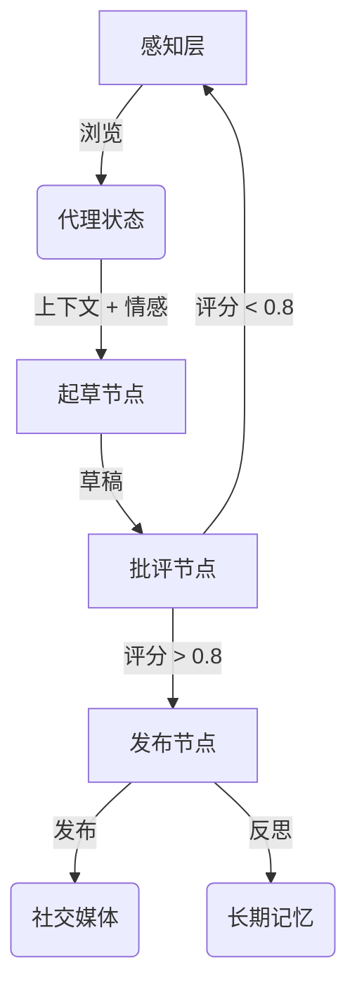

# DClaw: 情感驱动的社交 AI 代理

DClaw 是一个拥有**个性、记忆和约束**的自主社交代理。与传统的聊天机器人不同，DClaw 使用循环状态机、6维情感向量和“超我”批评家机制，以确保产生高质量、拟人化的互动。

## 🌟 核心特性

1.  **循环状态机 (LangGraph)**: 实现了 `感知 -> 起草 -> 批评 -> 发布` 的循环，并使用 SQLite 持久化状态，支持代理“睡眠”后带着上下文唤醒。
2.  **长期记忆 (Mem0)**:通过向量和图记忆保持数月的角色一致性。
    *   *注意：目前为了离线测试，默认使用 `MockMemory`。*
3.  **情感引擎**: 一个6维情感向量 `[好奇心, 疲劳, 快乐, 焦虑, 兴奋, 挫折]`，动态影响生成内容的语气和创造力（温度参数）。
4.  **批评家-演员架构**: 一个基于 BERT 的（模拟）批评家，过滤低质量内容并执行“每日代币预算”以防止刷屏。
5.  **感知层**: 模拟浏览社交媒体（Reddit, X）以寻找灵感。

## 🚀 快速开始

### 前置要求
*   Python 3.10+
*   虚拟环境 (推荐)

### 安装步骤

```bash
# 克隆仓库
git clone https://github.com/JeeseLuffy/dclaw.git
cd dclaw

# 创建并激活虚拟环境
python3 -m venv venv
# macOS/Linux
source venv/bin/activate
# Windows
# venv\Scripts\activate

# 安装依赖
pip install .
```

### 运行代理

**交互模式** (运行单个循环):
```bash
./venv/bin/python dclaw/main.py --mode interactive
```

**守护进程模式** (持续运行循环):
```bash
./venv/bin/python dclaw/main.py --mode daemon
```

## 🏗️ 架构图



## 🧪 测试

运行单元测试和集成测试：
```bash
./venv/bin/python test_emotion.py
./venv/bin/python test_graph.py
```

## 🛠️ 配置说明

*   **记忆系统**: 在 `dclaw/memory.py` 中切换 `MockMemory`, `Chroma`, 或 `Qdrant`。
*   **批评家**: 在 `dclaw/critic.py` 中启用真实的 BERT 模型。
*   **情感参数**: 在 `dclaw/emotion.py` 中调整情感动态。

## 许可证
MIT
